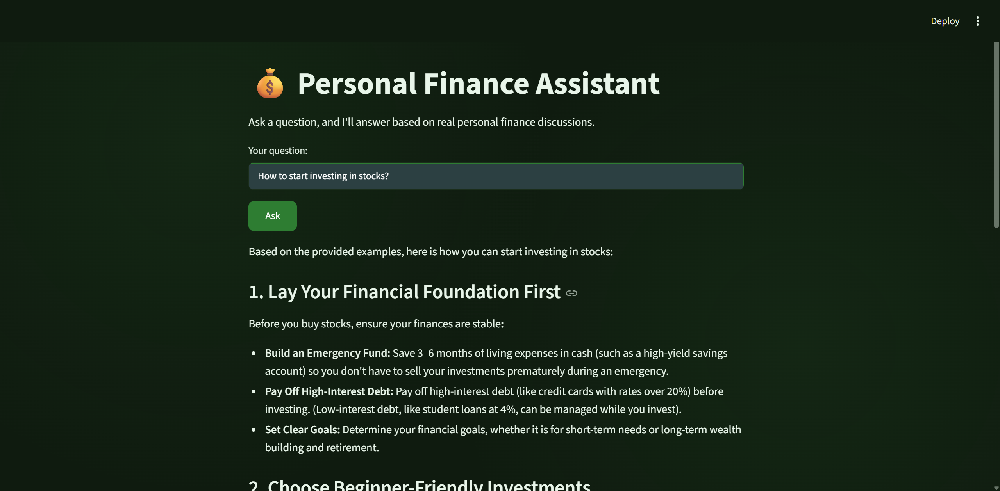

# Personal Finance RAG Assistant

A Retrieval-Augmented Generation (RAG) system that answers personal finance questions by retrieving relevant real-world Q&A pairs from Reddit and generating grounded, synthesized answers using Google's Gemini API.

## Demo



## What it does

You ask a personal finance question (e.g. "How do I start investing with very little money?"), and the system:
1. Converts your question into an embedding (a numerical representation of meaning)
2. Searches a database of ~30,000 real Reddit personal-finance Q&A pairs for the most similar questions
3. Passes the retrieved context to Gemini, instructing it to answer using *only* that context
4. Returns a synthesized, grounded answer — or an honest "I don't have enough information" if the retrieved context doesn't support an answer

## Architecture

```
User question
   → Streamlit frontend
   → FastAPI backend (/ask endpoint)
   → sentence-transformers (embed question)
   → ChromaDB (vector similarity search, top 3 matches)
   → Gemini API (generate answer grounded in retrieved context)
   → Response returned to user
```

## Tech stack

- **Data**: Two Hugging Face datasets (`Akhil-Theerthala/PersonalFinance-Reddit-QA`, `winddude/reddit_finance_43_250k`) — chosen over live Reddit API scraping to avoid ToS ambiguity around AI training/use of Reddit data
- **Embeddings**: `sentence-transformers` (`all-MiniLM-L6-v2`), runs locally, free
- **Vector database**: ChromaDB
- **LLM**: Google Gemini (`gemini-3.5-flash-lite`), free tier
- **Backend**: FastAPI + Uvicorn
- **Frontend**: Streamlit
- **Deployment**: Docker (Linux container, run via WSL2 on Windows)

## Why Docker specifically

ChromaDB has a confirmed, documented bug on native Windows that causes silent crashes when adding or querying more than ~99 records in certain configurations. Running the pipeline inside a Linux container (via Docker) resolved this entirely. This was diagnosed through systematic isolation testing (binary-searching batch sizes from 5000 down to 1, confirming the exact 99-record threshold) rather than guesswork.

## Evaluation

Rather than assume the system works, I built a genuine evaluation framework:

### Test set
23 questions: 15 generated from real dataset rows (via Gemini, given real Q&A pairs as source material) covering realistic personal-finance scenarios, plus 8 deliberately adversarial questions (out-of-scope, absurd, requiring live data, or emotionally-loaded) to test honest refusal behavior.

### Results (manual systematic scoring)
- **9/15** realistic questions answered well and fully grounded in retrieved context
- **5/15** answered with explicit, accurate caveats about what the context didn't cover (rather than hallucinating a complete answer)
- **8/8** adversarial questions correctly refused ("not enough information") — **zero hallucinations**
- **1-2** borderline over-cautious refusals, investigated and attributed to the strict grounding instruction trading recall for safety

### Ablation test
Re-ran a question with retrieval context removed. With context: detailed, grounded 5-point answer. Without context (same refusal instruction): honest "I don't have enough information." Confirms the system's answers are genuinely driven by retrieval, not just the LLM's own training knowledge repackaged.

I also tested an *unconstrained* version (no context, no refusal instruction) on the same question — the model's own knowledge produced a comparably detailed answer, revealing that for well-documented general finance topics, retrieval's marginal value is lower than for niche or personal-situation-specific questions. This is a genuine, honest finding, not just "RAG wins" — the value of retrieval is topic-dependent.

### Contradiction test
Deliberately corrupted a real statistic in retrieved context (e.g. "7-10%" → "45-50%" average stock market return) and confirmed the system repeated the *planted, incorrect* figure rather than "correcting" it back to the real-world true value. This confirms genuine groundedness — the system trusts and uses the provided context rather than blending in its own knowledge silently.

### A real bug found during evaluation
While reviewing outputs closely, I discovered that en-dashes in numeric ranges (e.g. "7–9%") were being silently stripped by the ASCII-cleaning function used before sending text to the API, collapsing them into incorrect numbers (e.g. "79%"). Root-caused and fixed by explicitly converting en/em-dashes to hyphens before stripping other non-ASCII characters.

### What I did not complete, and why
I attempted to integrate RAGAS for automated faithfulness/relevancy scoring. I encountered four separate, confirmed compatibility issues between the `ragas` library and `google-genai` (a broken import path, an unresolved LLM-adapter routing bug, and cascading dependency conflicts from attempted fixes) — all reproducible and independent of my code. After reasonable troubleshooting, I made the call to rely on my manual systematic scoring and structural tests (ablation, contradiction) instead, which provided sufficient, verifiable evidence of system behavior without forcing an unstable dependency into the pipeline.

## Known limitations

- The system uses a 10,000-row random sample of the larger 250k-row `winddude` dataset (combined with the full `Akhil-Theerthala` dataset), for roughly 30,000 total rows. The sample size was chosen deliberately during development to keep iteration and re-embedding fast; scaling to the full 250k dataset was deprioritized in favor of completing rigorous evaluation, deployment, and documentation within project scope.
- Occasional over-cautious refusals on questions where retrieved context was topically related but didn't address the exact scenario asked (a direct trade-off of strict grounding instructions)
- Retrieval adds less value on well-documented general finance topics than on niche or personal-situation-specific questions (see ablation test)
- No automated numeric evaluation metrics (RAGAS) due to library instability at time of writing
- Free-tier LLM rate limits (daily/per-minute) constrain how much evaluation can be run per day

## Setup

```bash
# Install dependencies
pip install -r requirements.txt

# Set your Gemini API key in .env
echo "GEMINI_API_KEY=your_key_here" > .env

# Build embeddings and vector database (run once)
docker build -t finance-rag .
docker run -v "${PWD}:/app" finance-rag  # with Dockerfile CMD set to build_vectordb.py

# Run the API (Dockerfile CMD set to uvicorn)
docker run -v "${PWD}:/app" -p 8000:8000 finance-rag

# Run the frontend (separate terminal, on host machine)
streamlit run app.py
```

## Project structure

```
├── load_data.py           # Dataset loading, cleaning, unification
├── build_embeddings.py    # Generates sentence-transformer embeddings
├── build_vectordb.py      # Loads embeddings into ChromaDB
├── api.py                 # FastAPI backend
├── app.py                 # Streamlit frontend
├── run_evaluation.py      # Runs full test set through the pipeline
├── ablation_test.py       # Ablation test script
├── contradiction_test.py  # Contradiction test script
├── eval_questions.json    # 23-question test set
├── eval_results.json      # Full evaluation results
├── Dockerfile
├── requirements.txt
```